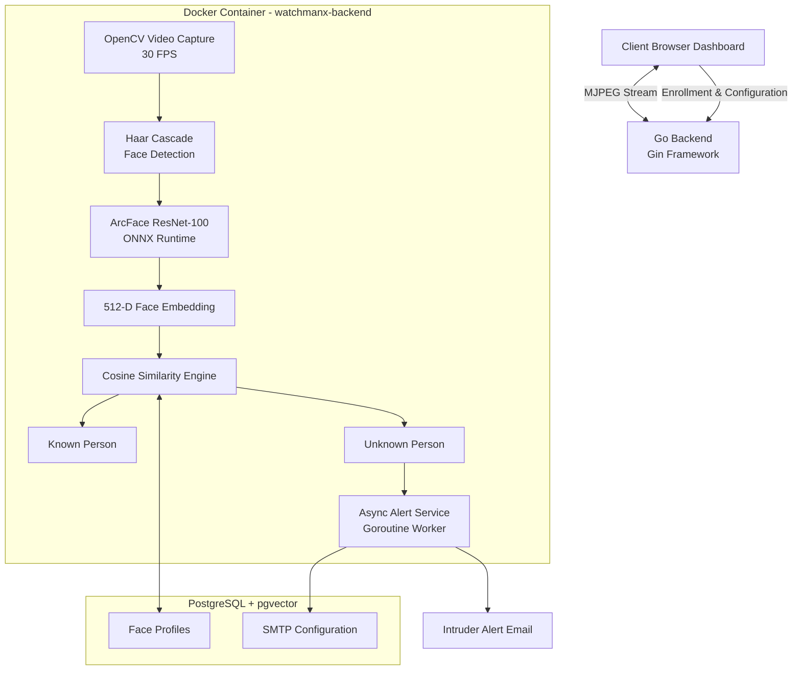

## System Architecture

```mermaid
flowchart TD

    Browser[Client Browser Dashboard]

    Browser <-->|MJPEG Stream| Gin[Go Backend<br/>Gin Framework]
    Browser -->|Enrollment & Configuration| Gin

    subgraph Docker["Docker Container - watchmanx-backend"]

        Camera[OpenCV Video Capture<br/>30 FPS]

        Detect[Haar Cascade<br/>Face Detection]

        ArcFace[ArcFace ResNet-100<br/>ONNX Runtime]

        Embed[512-D Face Embedding]

        Decision[Cosine Similarity Engine]

        Known[Known Person]
        Unknown[Unknown Person]

        Alert[Async Alert Service<br/>Goroutine Worker]

        Camera --> Detect
        Detect --> ArcFace
        ArcFace --> Embed
        Embed --> Decision

        Decision --> Known
        Decision --> Unknown

        Unknown --> Alert
    end

    subgraph Database["PostgreSQL + pgvector"]
        Faces[Face Profiles]
        Config[SMTP Configuration]
    end

    Decision <--> Faces
    Alert --> Config

    Alert --> Email[Intruder Alert Email]
```
